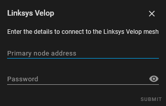

# Linksys Velop

Home Assistant integration for the Linksys Velop Wi-Fi system.

## Description

This custom component has been designed to for Home Assistant and enables 
access to the functions that would be useful in the Home Assistant environment.

### Definitions
 
- _Mesh_: the mesh is the network itself and refers to anything that is not 
  attributed to a single node or device in  the network.
- _Node_: a node is a device that helps to form the mesh.
- _Device_: a device is an endpoint that connects to the mesh network. Think 
  of these as the endpoint devices, such as a laptop, phone or tablet. 

### Entities Provided
Where applicable the sub-items in the list detail the additional attributes 
available.

#### Binary Sensors

- Mesh: Checking for Updates
- Mesh: Guest Wi-Fi state
  - list of guest networks available
- Mesh: Parental Control state
- Mesh: Speedtest state
  - current stage of the Speedtest, e.g. Detecting server, Checking latency
- Mesh: WAN Status
  - IP, DNS, MAC
- Node: Status
  - IP, MAC

#### Sensors

- Mesh: Number of Offline Devices
  - list of device names that are offline
- Mesh: Number of Online Devices
  - list of device names and IP addresses that are online
- Mesh: Date of Latest Speedtest
  - Exit code, Latency, Download/Upload bandwidth, Result ID
- Node: Number of Connected Devices
  - list of device names and IP addresses that are connected
- Node: Current Firmware Version
- Node: Model Number
- Node: Parent Name
  - IP address of the parent
- Node: Serial Number
- Node: Type of Node, e.g. Primary Secondary

#### Device  Trackers

These are selectable and are presented as part of the configuration at both 
install time and from reconfiguring the integration.

### Services

Services are available for the following: -

- Start a Speedtest
- Initiate a check for firmware updates for the nodes
- Change the state of the guest Wi-Fi &ast;
- Change the state of the Parental Controls feature &ast;

> &ast; these are considered long-running tasks. When the binary sensors spot 
  these tasks are running an additional timer is set up that polls every 
  second to get updates and updates the relevant attributes for that sensor.    

## Setup

When setting up the integration you will be asked for the following information.

- `Node address`: can be any node in the mesh
- `Password`: the password you would use to log in to either the app or the 
  web UI

On successful set up the following screen will be seen detailing the Mesh 
device and the individual nodes found in the mesh.

## Configurable Options

It is possible to configure the following options for the integration.

#### Timers

- `Scan Interval`: the frequency of updates for the sensors, default `30s`
- `Device Tracker Interval`: the frequency of updates for the device 
  trackers, default `10s`
- `Consider Home Period`: the time to wait before considering a device away 
  after it notifies of becoming disconnected, default `180s`

#### Device Trackers

- `Available devices`: a multi-select list of the devices found on the mesh. 
  This list excludes any device which doesn't have a name - typically 
  displayed in the official interfaces as `Network Device`